<div align="center">

# ASCII Wallpaper

**Mac masaüstün için yaşayan, nefes alan ASCII sanatı.**

CPU'na göre hızlanan dalgalar, indirme hızıyla yoğunlaşan yağmur, köşede saat ve sistem paneli.<br>
Bir de Claude Code çalışırken köşede yürüyen Clawd.


<p>
  <a href="https://digital-strategy.ec.europa.eu/sites/default/files/2026-06/AI%20LABELS_3x2_AI%20GENERATED_black.png">
    AI Generated
  </a>
</p>

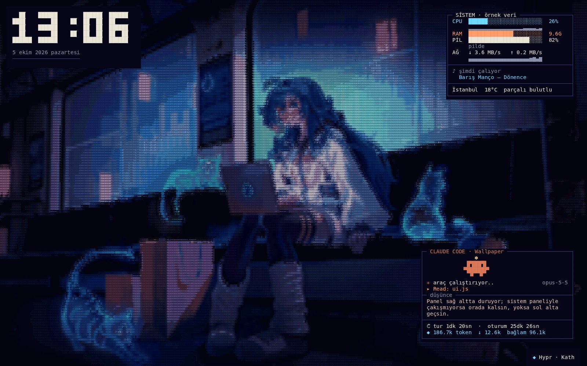

[Kurulum](#kurulum) · [Temalar](#temalar) · [Tema paketleri](#tema-paketleri) · [Claude Code paneli](#claude-code-paneli) · [Ekran koruyucu](#ekran-koruyucu) · [riceutil](#riceutil-ile-yönetmek) · [Geliştirme](#geliştirme)

</div>

## Neler var

- 🎨 **24 tema, üç paket**: 13 özgün sahne her kurulumda gelir (Klasik). Hyprland duvar kağıdı yarışmasının 9 kazanan görselinden üretilmiş ASCII sürümler (Hyprland paketi) ve Death Note'tan Misa Train ile Light Yagami (Anime paketi) [ayrı indirilir](#tema-paketleri).
- 📈 **Canlı sistem verisi**: CPU, RAM, pil, ağ, çalan şarkı (Spotify / Müzik) ve hava durumu. Temaların çoğu bu veriye tepki verir.
- 🦀 **Claude Code paneli**: Claude Code çalışırken ne yaptığı, son düşüncesi, süre ve token. Yanında yürüyen Clawd.
- 🌙 **Ekran koruyucu**: Aynı temalar `.saver` olarak, web görünümü olmadan JavaScriptCore + Core Text ile çizilir.
- 🖥️ **Çoklu ekran**, menü çubuğu simgesi, temaları sırayla değiştirme, oturum açılışında başlatma.
- 🔧 **[riceutil](https://github.com/eymndev/riceutil-macos) entegrasyonu**: terminalden ve GUI'den yönetim.

## Kurulum

Xcode veya Xcode Command Line Tools (`xcode-select --install`) gerekir; macOS 13 ve sonrası desteklenir.

En kolayı [riceutil](https://github.com/eymndev/riceutil-macos) ile:

```bash
riceutil wallpaper install
```

Elle kurmak için:

```bash
git clone https://github.com/eymndev/Wallpaper.git ~/Wallpaper
cd ~/Wallpaper
./scripts/install.sh
```

`scripts/install.sh` uygulamayı derleyip `~/Applications/ASCII Wallpaper.app` olarak kurar, ekran koruyucuyu kurar ve uygulamayı başlatır. Elle klonlanan depoda bütün paketler zaten indirilmiş olduğu için ilk kurulumda hepsi kurulur; riceutil ise yalnız Klasik temalarla başlar, paketleri istediğinde indirir. Güncellemek için `git pull` sonrası aynı komutu çalıştırman yeter; çalışan kopyayı kendisi kapatır.

<details>
<summary>Derlemeden kurmak, yalnızca derlemek</summary>

- `./scripts/build-app.sh` uygulamayı yalnızca `build/` içine üretir.
- GitHub Actions'taki her başarılı derlemenin "ASCII-Wallpaper" çıktısından hazır paketi indirebilirsin. İmzasız olduğu için ilk açılışta sağ tık → Aç demen gerekir.

</details>

### Kullanım

Uygulama Dock'ta görünmez. Menü çubuğundaki ızgara simgesinden şunları yapabilirsin:

- Tema seçmek ya da sonraki temaya geçmek
- Temaları 10 dakikada, 30 dakikada ya da saatte bir otomatik değiştirmek
- Sistem panelini, saati, sağ alt köşedeki tema adını ve Claude Code panelini açıp kapatmak
- Oturum açılışında otomatik başlatmak

Çalan şarkıyı ilk kez okurken macOS, Spotify veya Müzik için otomasyon izni ister.

## Temalar

Her tema saat, sistem paneli (örnek veri) ve köşedeki tema adıyla birlikte, 1440x900 ekranda çizildiği gibi. Temayı kimliğiyle seçebilirsin, örneğin `riceutil wallpaper theme misa-train`. Temalar üç pakette: Klasik her kurulumda gelir, Hyprland ve Anime [ayrı indirilir](#tema-paketleri).

### Klasik

<table>
  <tr><td align="center" width="50%">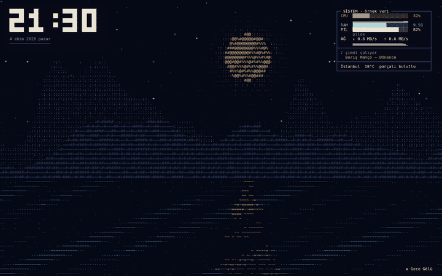<br><b>Gece Gölü</b> · <code>lake</code></td><td align="center" width="50%">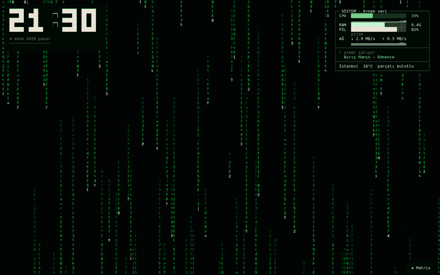<br><b>Matrix</b> · <code>matrix</code></td></tr>
  <tr><td align="center" width="50%">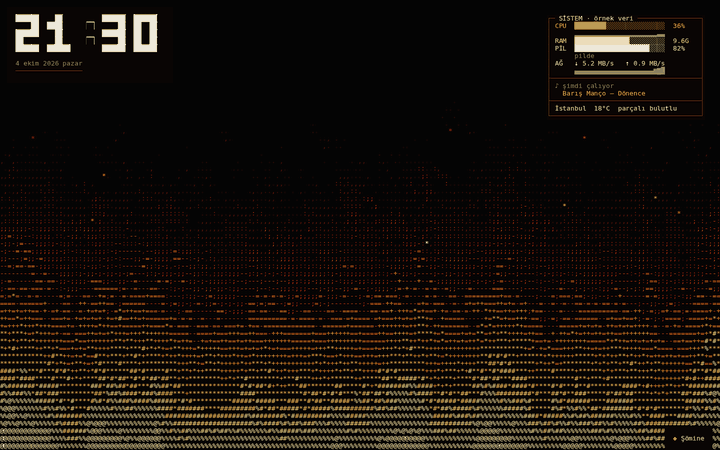<br><b>Şömine</b> · <code>fire</code></td><td align="center" width="50%">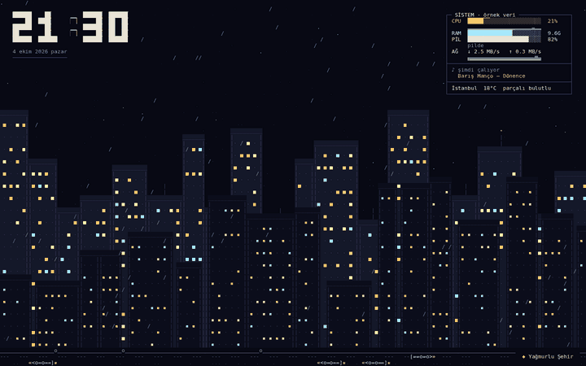<br><b>Yağmurlu Şehir</b> · <code>city</code></td></tr>
  <tr><td align="center" width="50%">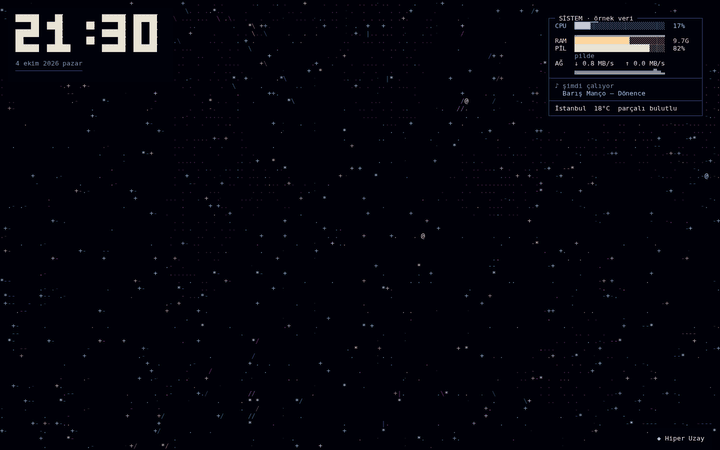<br><b>Hiper Uzay</b> · <code>starfield</code></td><td align="center" width="50%">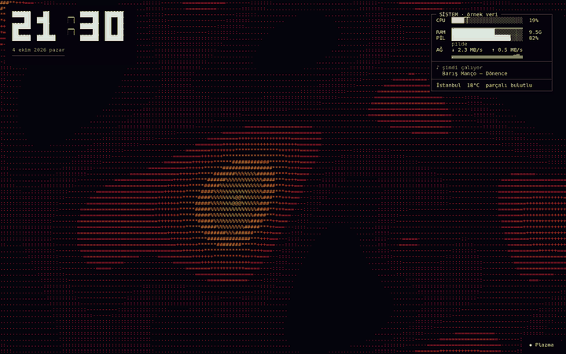<br><b>Plazma</b> · <code>plasma</code></td></tr>
  <tr><td align="center" width="50%">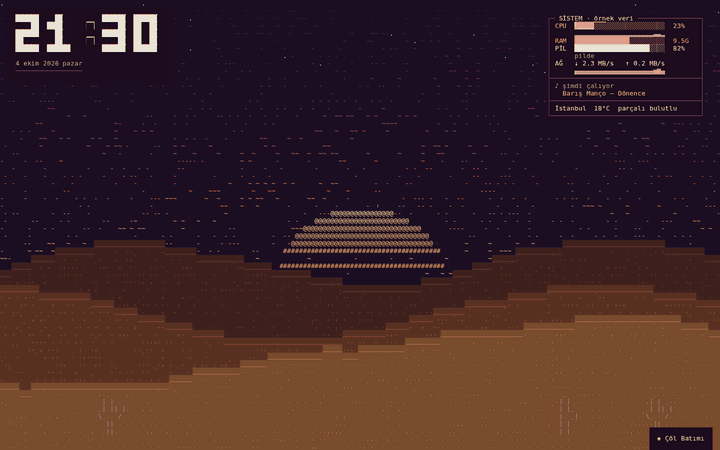<br><b>Çöl Batımı</b> · <code>desert</code></td><td align="center" width="50%">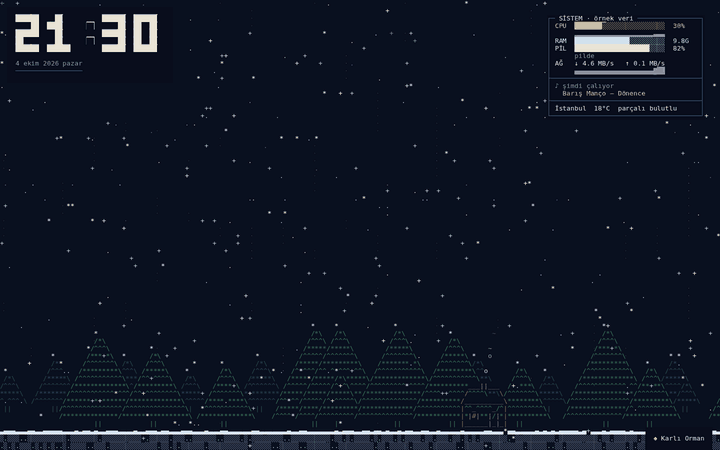<br><b>Karlı Orman</b> · <code>snow</code></td></tr>
  <tr><td align="center" width="50%">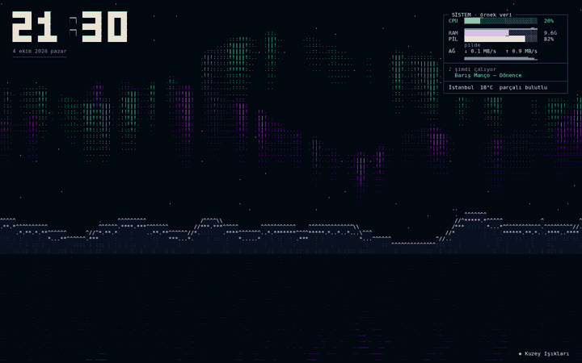<br><b>Kuzey Işıkları</b> · <code>aurora</code></td><td align="center" width="50%">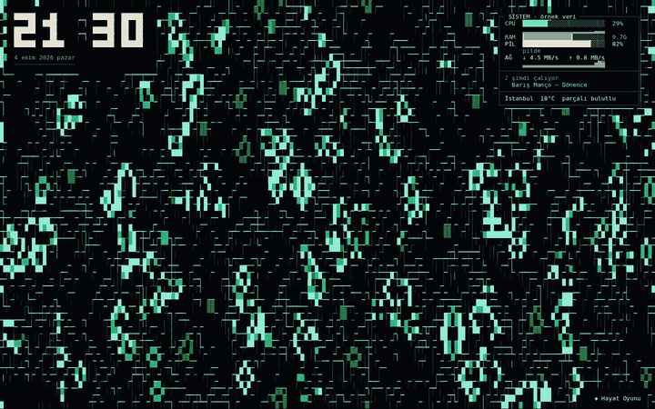<br><b>Hayat Oyunu</b> · <code>life</code></td></tr>
  <tr><td align="center" width="50%">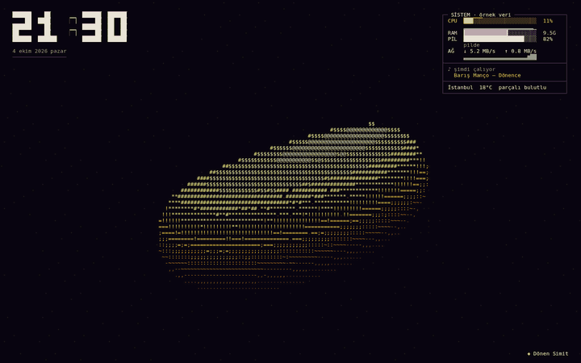<br><b>Dönen Simit</b> · <code>donut</code></td><td align="center" width="50%">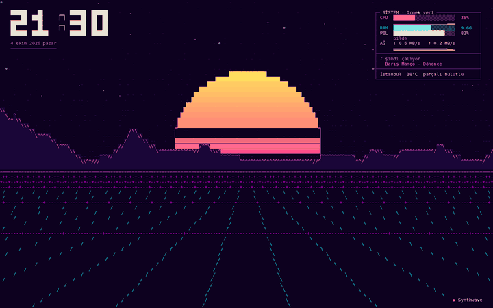<br><b>Synthwave</b> · <code>synthwave</code></td></tr>
  <tr><td align="center" width="50%">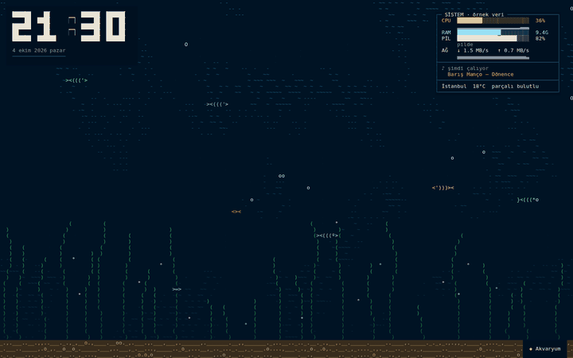<br><b>Akvaryum</b> · <code>aquarium</code></td></tr>
</table>

### Hyprland paketi

`riceutil wallpaper pack add hyprland` · [Hyprland duvar kağıdı yarışmasının](https://hypr.land/news/contestWinners) dokuz kazanan görseli (`hypr-*`) ASCII'ye çevrildi. Her biri görselin kendisinden üretilir ve üstüne hafif bir animasyon eklenir; CPU yükseldikçe animasyon hızlanır. Görsel ayrıntı görünsün diye daha sık ızgarayla (küçük karakterlerle) çizilir; saat ve panel diğer temalardaki boyutta kalır.

<table>
  <tr><td align="center" width="50%">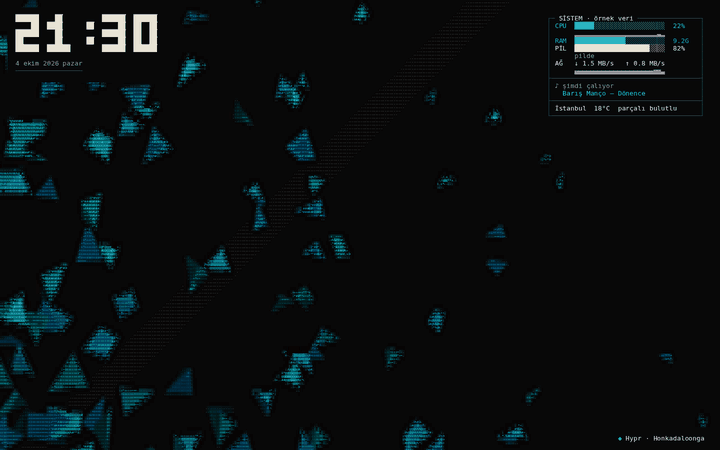<br><b>Hypr · Honkadaloonga</b> · <code>hypr-honkadaloonga</code></td><td align="center" width="50%">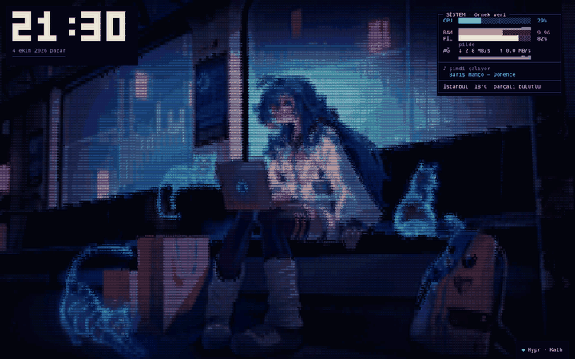<br><b>Hypr · Kath</b> · <code>hypr-kath</code></td></tr>
  <tr><td align="center" width="50%">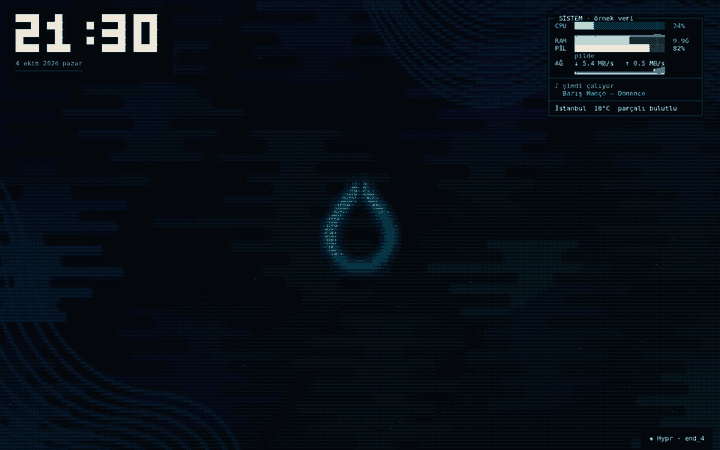<br><b>Hypr · end_4</b> · <code>hypr-end4</code></td><td align="center" width="50%">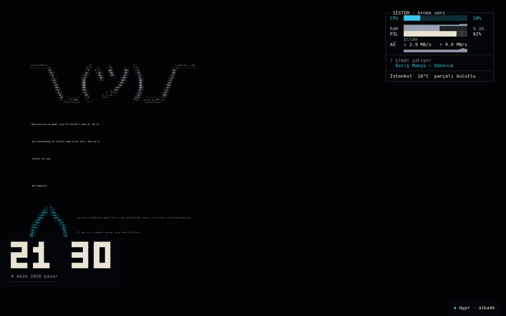<br><b>Hypr · alba4k</b> · <code>hypr-alba4k</code></td></tr>
  <tr><td align="center" width="50%">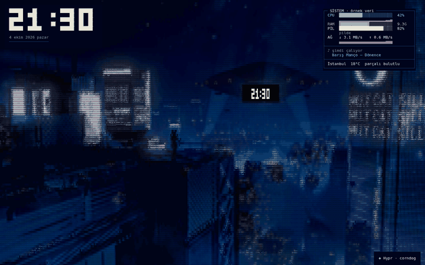<br><b>Hypr · corndog</b> · <code>hypr-corndog</code></td><td align="center" width="50%">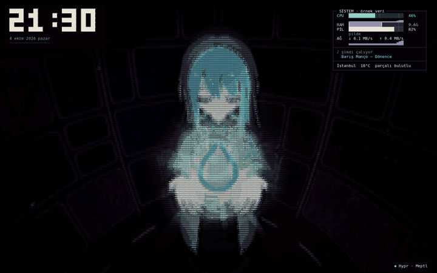<br><b>Hypr · Meptl</b> · <code>hypr-meptl</code></td></tr>
  <tr><td align="center" width="50%">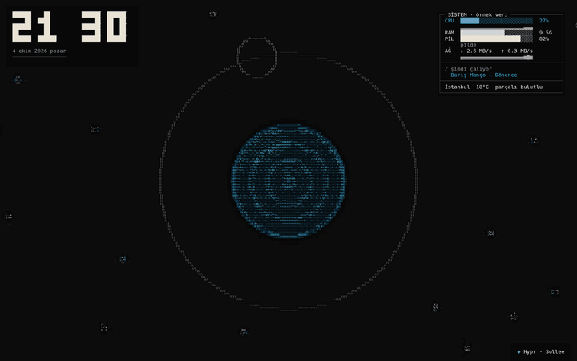<br><b>Hypr · Sollee</b> · <code>hypr-sollee</code></td><td align="center" width="50%">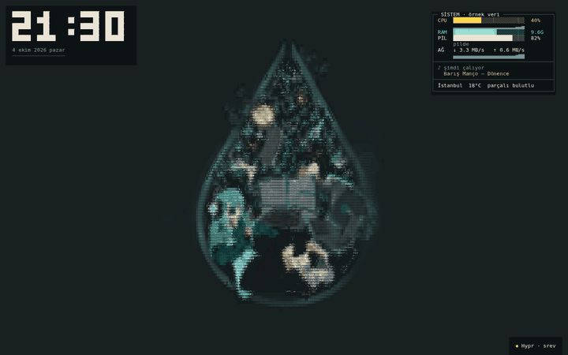<br><b>Hypr · srev</b> · <code>hypr-srev</code></td></tr>
  <tr><td align="center" width="50%">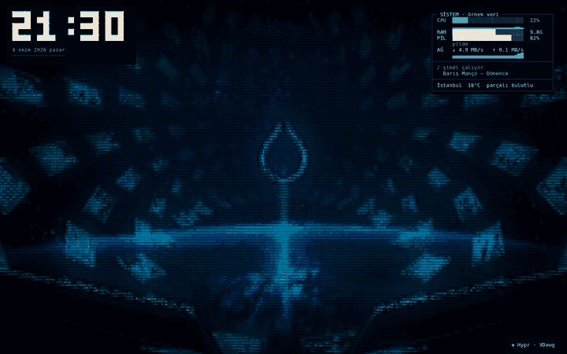<br><b>Hypr · VDawg</b> · <code>hypr-vdawg</code></td></tr>
</table>

### Anime paketi

`riceutil wallpaper pack add anime` · Death Note'tan iki sahne.

<table>
  <tr><td align="center" width="50%">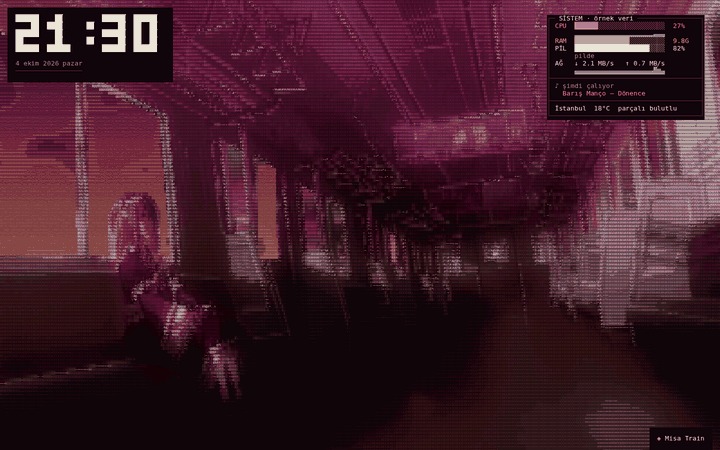<br><b>Misa Train</b> · <code>misa-train</code></td><td align="center" width="50%">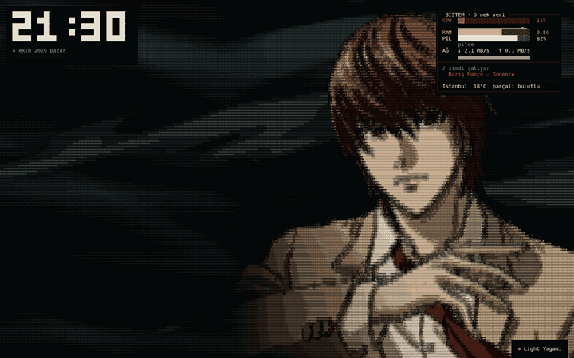<br><b>Light Yagami</b> · <code>light-yagami</code></td></tr>
</table>

#### Misa Train

`misa-train` (eski kimliği `deathnote-misa` da çalışır): Death Note'un son bölümünden, Misa'nın Light'ın öldüğünden habersiz gün batımında boş bir trende oturduğu sahne. Vagon görselden üretilir; pencerelerdeki gökyüzü canlı çizilir: bulutlar akar, direkler ve teller geçer, gün batımının rengi birkaç dakikada bir morla turuncu arasında gidip gelir, tavandaki tutamaklar trenin sallantısıyla sallanır. CPU yükseldikçe tren hızlanır.

#### Light Yagami

`light-yagami`: Light, rüzgarda kravatını gevşetirken. Kare görsel 16:9'a yerleştirildi; solda görseldeki gibi koyu, dalgalı rüzgar şeritleri sağa doğru akar, arada bir gözlerinde kırmızı bir parıltı yanıp söner. CPU yükseldikçe rüzgar hızlanır.

## Tema paketleri

Klasik temalar uygulamanın içinde gelir. Hyprland ve Anime paketleri ayrı indirilir; istemediğin paketi hiç indirmezsin:

```bash
riceutil wallpaper packs                # paketler ve durumları (dahili / kurulu / indirilebilir)
riceutil wallpaper pack add anime       # indirir ve kurar, çalışan duvar kağıdı yeni temaları hemen alır
riceutil wallpaper pack remove hyprland # kaldırır
```

riceutil GUI'sinde Duvar Kağıdı sayfasındaki "Tema paketleri" bölümünden de indirip kaldırabilirsin.

riceutil depoyu seyrek (sparse) ve dosyasız (`--filter=blob:none`) klonlar: bir paketin görselleri ancak o paket eklenince indirilir. Paketler `~/Library/Application Support/ASCII Wallpaper/packs/<paket>/` içine kurulur; duvar kağıdı ve ekran koruyucu temaları oradan yükler. `riceutil wallpaper update` kurulu paketleri de günceller. Paketlerden önceki bir sürümden güncellenirken o an depoda olan bütün paketler kurulur, yani daha önce kullandığın temalar kaybolmaz.

riceutil olmadan, depo klasöründe:

```bash
./scripts/pack.sh list
./scripts/pack.sh add anime
./scripts/pack.sh remove anime
```

## Claude Code paneli

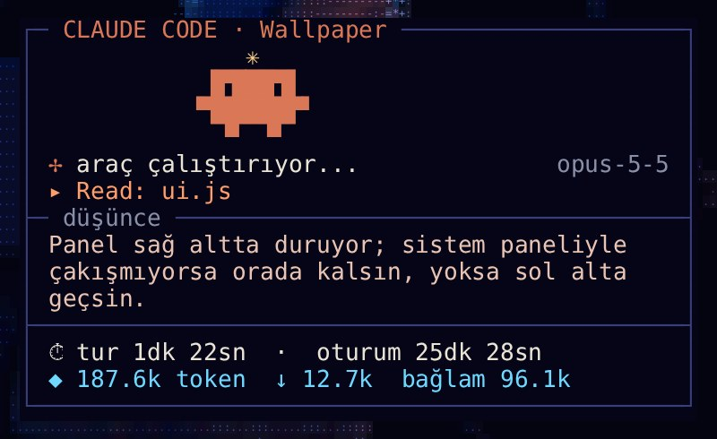

Bilgisayarda [Claude Code](https://claude.com/claude-code) çalışıyorsa hem duvar kağıdında hem ekran koruyucuda sağ altta bir panel çıkar:

- **Clawd** panelde yürür: düşünürken balon, araç çalıştırırken zıplama, beklerken uyuklama
- **Durum**: düşünüyor / araç çalıştırıyor / yazıyor / seni bekliyor, yanında model
- **Çalışan araç** (`Bash: npm test`, `Read: ui.js` …)
- **Son düşüncesi** ya da yazdığı mesaj
- **Süre**: bu tur ve bütün oturum
- **Token**: toplam, çıktı (↓) ve bağlam boyutu

Ağ, API anahtarı veya ek kurulum gerekmez.

<br clear="right">

<details>
<summary>Nasıl çalışıyor?</summary>

Veri `~/.claude/sessions/*.json` (açık oturumlar) ve `~/.claude/projects/<proje>/<oturum>.jsonl` (oturum kaydı) dosyalarından okunur. Birden çok oturum açıksa meşgul olan, yoksa en son değişen gösterilir; 15 dakika hareketsiz kalan oturumun paneli kaybolur. Claude Code düşünce metnini kayda boş yazıyorsa panel son mesajı gösterir. Menü çubuğundan ya da ekran koruyucunun Seçenekler penceresinden kapatılabilir. Tarayıcıda `web/index.html?claude=demo` örnek veriyle gösterir.

</details>

## Ekran koruyucu

Aynı temalar macOS ekran koruyucusu olarak da var (`scripts/install.sh` bunu zaten kurar):

```bash
./scripts/build-saver.sh --install
```

Sonra Sistem Ayarları → Ekran Koruyucu'dan "ASCII Wallpaper"ı seç. "Seçenekler" düğmesinden tema (ya da her açılışta rastgele tema), sistem paneli, saat, köşedeki tema adı ve Claude Code paneli ayarlanır. Ekran koruyucu CPU, RAM, pil, ağ ve Claude Code bilgisini gösterir; çalan şarkı ve hava durumu yalnızca duvar kağıdı uygulamasında var.

Derlemek istemezsen GitHub Actions'taki "ASCII-Wallpaper-Saver" çıktısını indirip `.saver` dosyasına çift tıklayabilirsin. İmzasız olduğu için macOS engellerse önce şunu çalıştır:

```bash
xattr -dr com.apple.quarantine "ASCII Wallpaper.saver"
```

> [!TIP]
> Ekran koruyucu bir süre sonra kararıyorsa bu genelde macOS'un ekranı uyutmasıdır: Sistem Ayarları → Kilit Ekranı → "Etkin değilken ekranı kapat" süresini uzat.

## Ayarlar

### Hava durumu konumu

Varsayılan konum İstanbul. Değiştirmek için uygulamayı kapatıp şunu çalıştır:

```bash
defaults write dev.eymn.ascii-wallpaper city "Ankara"
defaults write dev.eymn.ascii-wallpaper latitude -float 39.93
defaults write dev.eymn.ascii-wallpaper longitude -float 32.86
```

## riceutil ile yönetmek

[riceutil](https://github.com/eymndev/riceutil-macos) duvar kağıdını terminalden ve kendi GUI'sinden yönetir:

```bash
riceutil wallpaper themes          # temaları listeler, etkin olanı işaretler
riceutil wallpaper packs           # tema paketleri; pack add|remove <paket> ile indir / kaldır
riceutil wallpaper theme fire      # temayı değiştirir
riceutil wallpaper next            # sonraki tema
riceutil wallpaper name off        # köşedeki tema adını gizler
riceutil wallpaper start | stop    # başlatır / kapatır
riceutil wallpaper update          # depoyu çekip yeniden derler ve kurar
```

<details>
<summary>Dış komut arayüzü</summary>

Çalışan uygulama bu komutları `dev.eymn.ascii-wallpaper.command` dağıtık bildirimiyle alır. `userInfo` anahtarları metindir: `theme` (tema kimliği), `next`, `panel` / `clock` / `name` (`1` ya da `0`), `rotate` (dakika) ve `packs` (`reload`: paketler değişti, sayfalar yeniden açılır). Klasik temaların listesi `web/themes.tsv`, her paketinki `packs/<paket>/themes.tsv` dosyasındadır (`kimlik<TAB>ad`); paket kataloğu `web/packs.tsv` (`kimlik<TAB>ad<TAB>dahili<TAB>tema sayısı<TAB>açıklama`).

</details>

## Geliştirme

### Tarayıcıda deneme

`web/index.html` dosyasını tarayıcıda açman yeterli. Uygulama dışında örnek veri gösterilir; depodaki bütün paketler de yüklenir (`packs/index.js`).

- `←` / `→` ya da tıklama temalar arasında gezer, `p` paneli, `n` tema adını açıp kapatır
- `index.html?theme=fire` belirli bir temayla açar, `?panel=0` paneli, `?name=0` tema adını gizler, `?claude=demo` Claude Code panelini örnek veriyle gösterir

### Yeni tema eklemek

Klasik bir tema için `web/js/themes/` içine bir dosya ekle ve `web/index.html` içinde `main.js`'ten önce yükle. Bir pakete eklemek için dosyayı `packs/<paket>/js/` içine koy ve `packs/<paket>/pack.json` içindeki `scripts` listesine ekle; yeni bir paket için `pack.json`'lu yeni bir `packs/<paket>/` klasörü yeterli.

```js
(function (G) {
  const AW = G.AW;
  AW.register({
    id: "ornek",
    name: "Örnek",
    bg: "#000000",
    ui: { accent: "#ffb35c" }, // isteğe bağlı panel renkleri
    init(g, S) { return { /* temaya özel durum */ }; },
    frame(g, t, dt, S, st) {
      // g: karakter ızgarası (g.cols, g.rows, g.aspect, g.set, g.put, g.sprite, g.setBg)
      // t: saniye, dt: kare süresi, S: sistem verisi (S.cpu, S.ram, S.down ...)
      g.put(2, 2, "merhaba", "#ffffff");
    },
  });
})(globalThis);
```

### Görselden tema

Bir görseli tema verisine çevirmek için (Pillow gerekir):

```bash
python3 scripts/encode-image.py gorsel.png benim-tema
```

Bu `packs/hyprland/js/hypr/benim-tema.data.js` dosyasını üretir (`--dir packs/anime/js/light` gibi bir seçenekle depo kökünden başka bir dizine yazar). Varsayılan boyut 320x180; yüz gibi ince ayrıntı olan görsellerde `--size 640x360` kullan. Dosyayı paketin `pack.json` listesine ekle ve `AW.imageTheme({ id, name, image: "benim-tema", bg, glow, sweep, ... })` ile kaydet; seçeneklerin örnekleri `packs/hyprland/js/hypr.js` içinde.

Tema ekledikten sonra:

1. `node scripts/themes-manifest.mjs`: `web/themes.tsv`, `packs/<paket>/themes.tsv`, `web/packs.tsv` ve `packs/index.js` listelerini günceller (riceutil temaları ve paketleri buradan okur).
2. `node scripts/previews.cjs benim-tema`: `web/previews/benim-tema.jpg` (paketteyse `packs/<paket>/previews/`) önizlemesini üretir (Playwright gerekir: `npm i -g playwright`). riceutil GUI'si tema kartlarında bu görselleri gösterir.
3. `node scripts/gifs.cjs benim-tema`: README galerisindeki `docs/gifs/benim-tema.gif` dosyasını üretir (Playwright ve Pillow gerekir); galeri tablosuna da bir hücre ekle.
4. `npm test`: her temayı farklı ekran boyutlarında tarayıcı olmadan çalıştırıp hatasız çizdiğini kontrol eder.

### Yapı

```
web/            Duvar kağıdı sayfası (motor, arayüz, Klasik temalar)
packs/          Ayrı indirilen tema paketleri (hyprland, anime)
mac/            Swift uygulaması (masaüstü penceresi, istatistikler, Claude Code izleyici, menü)
mac/Saver/      Ekran koruyucu (.saver)
scripts/        Derleme, kurulum, paket, tema listesi ve görselden tema üretme betikleri
tests/          Node testleri
docs/           README görselleri, docs/gifs/ galeri GIF'leri
```
